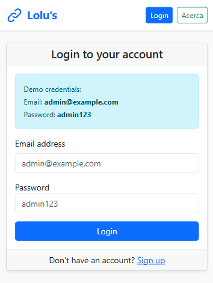
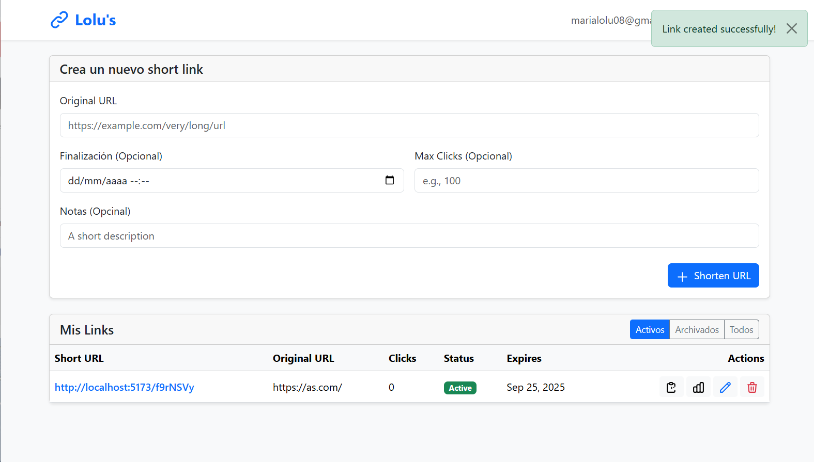
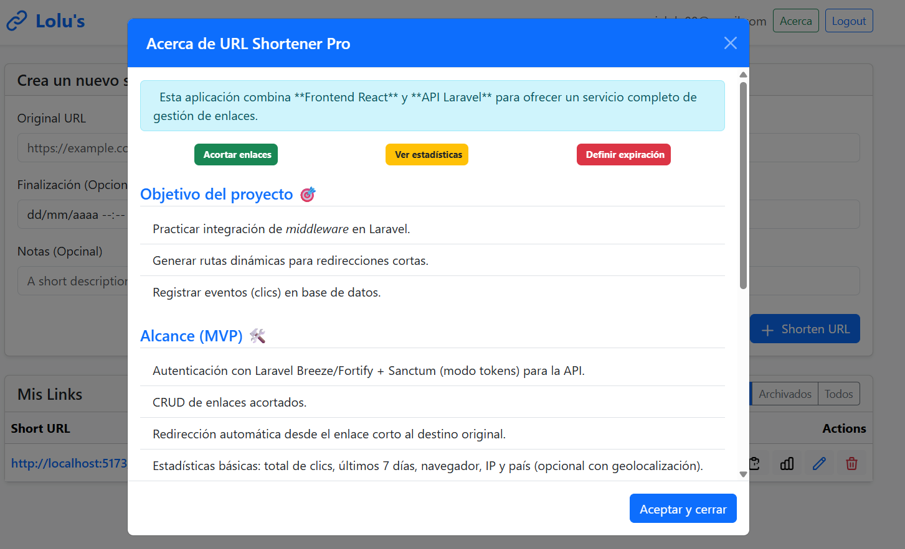

# URL Shortener Dashboard (Frontend)

Frontend en **React + Vite** para el proyecto **URL Shortener PRO**.  
Sirve como panel de administración y visualización de estadísticas de los enlaces acortados.

[](https://url-shortener-frontend.up.railway.app/)

---

## 🖼️ Demo

🔗 [**Ver aplicación en producción**](https://url-shortener-frontend.up.railway.app/)

_(El frontend está desplegado en Railway y conectado con la API de Laravel)_

---

## 📸 Capturas de pantalla

<!-- Inserta aquí las imágenes -->
<p align="center">
<h3>Login</h3>

<h3>Dashboard</h3>
  
  <h3>Ventana modal </h3>
  
   
</p>

---

## 🚀 Tecnologías

- [React 19](https://react.dev/)
- [Vite 6](https://vitejs.dev/)
- [React Router DOM 7](https://reactrouter.com/)
- [React Bootstrap](https://react-bootstrap.github.io/)
- [Recharts](https://recharts.org/)
- [Bootstrap 5](https://getbootstrap.com/)

---

## 📦 Scripts disponibles

```bash
# Entorno local de desarrollo
npm run dev

# Generar build de producción
npm run build

# Previsualizar build
npm run preview

# Producción en Railway (sirve dist/ con SPA fallback)
npm start
```

---

## ⚙️ Configuración de entorno

Este proyecto usa variables de entorno con prefijo `VITE_`.  
Crea un archivo `.env` en la raíz con:

```env
VITE_API_URL=http://localhost:8000/api/v1
```

En Railway, define la misma variable en **Settings → Variables**:

```env
VITE_API_URL=https://tu-backend.up.railway.app/api/v1
```

---

## ☁️ Deploy en Railway

### Opción 1: Node + Serve (recomendada)

1. Instalar dependencias:
   ```bash
   npm install
   ```
2. Railway ejecuta:
   ```bash
   npm run build
   npm start
   ```
3. En `package.json` se usa:
   ```json
   "start": "serve -s dist -l $PORT"
   ```
   Esto asegura fallback SPA (`react-router-dom`) y puerto dinámico.

### Opción 2: Static Site

1. Crear servicio **Static** en Railway.
2. Configurar:
   - **Build command:** `npm ci && npm run build`
   - **Output directory:** `dist`
   - **SPA fallback:** ✅ habilitado

---

## 🔧 Optimización de bundle

El build puede mostrar avisos de chunks grandes (>500kb).  
Opciones:

- Carga diferida con `import()`.
- Dividir vendors en `vite.config.ts`:
  ```ts
  build: {
    rollupOptions: {
      output: {
        manualChunks: {
          reactVendor: ['react', 'react-dom', 'react-router-dom'],
          uiVendor: ['react-bootstrap', 'bootstrap']
        }
      }
    }
  }
  ```

---

## 🖼️ Estructura del proyecto

```
src/
 ├── api/          # llamadas al backend
 ├── auth/         # contexto y hooks de autenticación
 ├── components/   # componentes UI
 ├── pages/        # vistas con React Router
 ├── App.jsx
 └── main.jsx
```

---

## ✅ Checklist antes de deploy

- [ ] `npm run build` genera correctamente `dist/`
- [ ] Variable `VITE_API_URL` definida en Railway
- [ ] Railway usa `npm start` o servicio estático con SPA fallback
- [ ] Capturas añadidas en `docs/screenshot1.png` y `docs/screenshot2.png`

---

## 🔗 Repos relacionados

- **Backend/API (Laravel + Sanctum + PostgreSQL):**  
  👉 [URL-Shortener-Pro](https://github.com/Merimer08/URL-Shortener-Pro)

---

## 📄 Licencia

MIT
